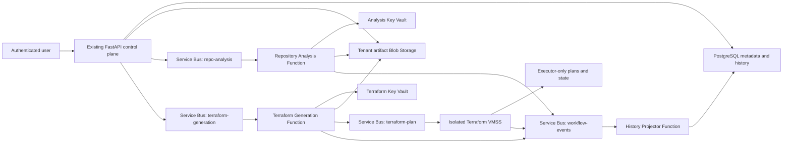

# Azure Deployment Plan — ZeroOps AI

> **Status:** Approved; local implementation and pre-deployment validation are in progress. Deployment is not authorized.
>
> **Architecture approval:** User-approved on 2026-07-29.
>
> **Authority:** [`infra/`](../infra/) is the deployable infrastructure source of truth. [`infrastructure-plan.json`](./infrastructure-plan.json) is a conceptual decision graph, not deployable IaC.

Generated: 2026-07-31

---

## 1. Outcome and scope

ZeroOps AI is being prepared as a tenant-ready Azure SaaS control plane that:

1. stores a user's repository input and all user-visible results in tenant-isolated Blob Storage;
2. uses one isolated model credential for repository analysis and a different one for Terraform generation;
3. generates a validated, immutable Terraform bundle only after an approved architecture revision;
4. runs Terraform validation, plan, cost/policy checks, and any future apply only on an isolated VM Scale Set (VMSS);
5. preserves a redacted, accessible run and artifact history; and
6. keeps scale-to-zero and evidence-based cost optimisation central to every stage.

This pass creates local application, Function, worker, Terraform, test, CI, and Azure AI Foundry assets. It does **not** deploy Azure workload resources, insert API keys, change existing application configuration, or run Terraform apply.

## 2. Confirmed Azure context

| Attribute | Selected value |
|---|---|
| Subscription | Azure for Students (`9277603e-b858-4253-b1ed-e6747e316519`) |
| Microsoft Entra tenant | `a99f8a86-256f-4146-ad3c-e658a27f7a47` |
| Region | Central India (`centralindia`) |
| Existing resource group | `zeroops-rg` |
| Architecture | Single-region asynchronous control plane; multi-tenant-ready with personal workspace bridge |
| IaC | Terraform 1.15.8, AzureRM 4.81.0, AzAPI 2.11.0 |

Terraform reads the existing B1 App Service plan, frontend, backend, Key Vault,
PostgreSQL server, and backend managed identity through `data` sources. It does
not import, own, resize, or modify those resources.

## 3. Implemented architecture



The trust boundaries are deliberate:

| Workload | May do | Must not do |
|---|---|---|
| API | authenticate, authorize, create durable run/artifact records, enqueue ID-only work, serve history downloads | model inference, Terraform execution, executor-state access |
| Repository Analysis Function | use only analysis model key, read/write tenant artifacts, emit workflow events | Terraform generation/apply, database access, Terraform model key |
| Terraform Generation Function | use only generation model key, produce constrained bundle, enqueue plan envelope | repository model key, apply, database access |
| History Projector | consume sessioned events and idempotently project safe history to PostgreSQL | model inference, raw source/state access |
| VMSS worker | validate/plan/apply an exact immutable bundle and saved plan | model access, unapproved free-form Terraform |

## 4. Model and Foundry contract

For current testing, both routes use GitHub Models but never share a credential:

| Workload | Provider/model | Configuration/key boundary | Failure policy |
|---|---|---|---|
| Repository analysis | `openai/gpt-4o` | `AI_REPOSITORY_*`, analysis Function UAMI, analysis Key Vault | deterministic scanner result may be returned with explicit provenance |
| Terraform generation | `openai/gpt-4.1` | `AI_TERRAFORM_*`, generation Function UAMI, generation Key Vault | fail closed; no fallback to the analysis key |

The detailed Foundry portal package lives in [`ai-specs/`](../ai-specs/): strict
schemas, instructions, GitHub Models prompts, evaluations, redaction rules,
cost policy, and migration notes. A future Foundry deployment switches the
provider configuration to managed identity; it does not merge the two trust
boundaries or introduce a shared key.

## 5. Tenant data, durable history, and artifact access

An internal ZeroOps tenant is independent of a customer's Microsoft Entra
tenant. The current MVP gives each existing user a personal internal tenant and
tenant membership. `OperationRun`, `Artifact`, and `ActivityEvent` are tenant
owned; `Project` remains user-scoped during this bridge period and is checked
through its owner/membership relationship. A future direct project `tenant_id`
migration is explicitly planned rather than implied.

Every immutable user artifact uses the canonical opaque layout:

```text
t-<40 lowercase hex>/objects/<artifact UUID>/v<positive integer>/<lowercase SHA-256>
```

Artifact metadata records the container, path, version, digest, media type,
classification, and redacted metadata. The API streams a requested artifact
only after tenant ownership, user access scope, Blob size, and SHA-256 checks.
The browser receives neither a SAS URL nor Blob credentials. Raw Terraform
state, saved binary plans, leases, and checkpoints live only in executor-only
storage and are never served by the history API.

Model provenance is currently recorded on `OperationRun` and workflow-event
safe metadata: provider, model, prompt/schema version, token fields where
available, request input digest, and redacted summary. There is no normalized
`model_invocations` table in the current schema.

## 6. Terraform and VMSS execution contract

The Terraform-generation Function validates strict structured output, emits a
canonical JSON audit artifact, and produces a deterministic ZIP containing only
validated root `.tf` files plus the application-owned AzureRM lock file. It
then emits a strict `ExecutionEnvelope` v1 containing the tenant, user,
project, workflow/run, target subscription/tenant, Terraform 1.15.8, bundle
digest, Blob ETag, and executor-state key. The VMSS accepts no free-form
Terraform source on its queue.

The worker rejects unsafe paths, symlinks, unsupported providers/resources,
provisioners, `null_resource`, external commands, embedded credentials, and
unapproved public networking. It requires the lock file and runs format,
initialization, validation, TFLint, Checkov/policy checks, and a saved plan
before any approval stage. A generated bundle blocked by policy is audited but
never enqueued.

The worker already binds a plan/apply envelope to the plan-job digest, bundle
SHA-256, raw-plan SHA-256, and ETag; it rejects approvals older than 24 hours.
The API's durable, single-use approval issuance/consumption flow and its full
cost/scope envelope still require end-to-end control-plane integration. Until
that is implemented and tested, production apply remains intentionally blocked.

## 7. Cost controls: implemented versus planned

Implemented in local code/IaC:

- test profile Functions and VMSS scale to zero; VMSS uses regular (not Spot) instances;
- one bounded repair attempt, bounded model I/O, qualitative optimisation policy, and separate model paths;
- cache-key contracts based on immutable input/version material;
- Standard Service Bus, Basic ACR, FC1 Functions, LRS Function hosts, and a one-instance test VMSS cap;
- optional Azure budget resource, explicit production switches, storage lifecycle rules, and audit retention;
- only deterministic pricing/cost evidence may support a numeric claim; a model may explain trade-offs but cannot invent price.

Planned before a production cost claim:

- enforced per-tenant daily monetary/token budgets and concurrency counters;
- verified live price ingestion and actual-cost attribution;
- VMSS cost-policy gate and approval cost envelope;
- cache storage/eviction metrics and empirical scale thresholds.

## 8. Azure provider and validation side effect

No ZeroOps workload resource was deployed or created by this work. However, an
earlier Terraform planning attempt caused AzureRM to automatically register 31
subscription resource providers on 2026-07-29 (activity-log correlation
`eb2c8d9e-fe34-0c6b-ea2e-9f5ed94f95c8`). Provider registration is an Azure
control-plane mutation and is recorded here transparently. The affected list
includes `Microsoft.Compute`, `Microsoft.Network`, `Microsoft.Storage`,
`Microsoft.ServiceBus`, `Microsoft.ContainerRegistry`, and related providers.

`infra/providers.tf` now sets:

```hcl
resource_provider_registrations = "none"
```

This prevents future Terraform validation/planning from registering providers
implicitly. Do not unregister any provider without explicit user approval,
because the registration could be used by other subscription workloads.

`Microsoft.App` remains not registered and is a deployment prerequisite because
the Flex Consumption subnet is delegated to `Microsoft.App/environments`.
`Microsoft.Quota` remains not registered, so generic quota API results require
a post-authorization preflight. The provider/quota runbook documents the live
checks required immediately before deployment.

## 9. Static RBAC review

The Terraform graph scopes data-plane access to the resource or queue, not the
subscription or resource group:

- existing backend: send only to repository-analysis, Terraform-generation,
  and apply queues; write only tenant artifacts;
- analysis Function: receive repository jobs, send workflow events, write
  tenant artifacts, and read only the analysis Key Vault;
- generation Function: receive generation jobs, send plan/events, write tenant
  artifacts, and read only the generation Key Vault;
- history Function: receive only workflow events; PostgreSQL access is a
  separately provisioned database-local Entra role;
- executor: receive plan/apply, send workflow events, read/write its required
  tenant artifacts and executor-only state/plan containers, pull its image, and
  receive Contributor only on an explicit dedicated customer workload group.

The backend and Functions receive no executor-state access; the VMSS receives
no model Key Vault access. The required database-local projector role and
function deployment identity permissions are external deployment prerequisites.

## 10. Validation proof and remaining gates

The following commands completed on 2026-07-31 without provisioning a workload:

| Check | Result |
|---|---|
| `APP_ENV=test python -m pytest backend/tests -q` | 142 passed; 115 Python 3.14 `datetime.utcnow()` deprecation warnings (no test failure) |
| Supported Python 3.13 Function environment with pinned requirements | 22 Function contract tests and 15 VMSS worker tests passed |
| `python scripts/generate_ai_schemas.py --check` and two `package_functions.py` runs | passed; all three ZIP hashes were byte-for-byte deterministic; Function/worker imports passed |
| Terraform 1.15.8: `fmt -check`, `init -backend=false`, `validate`, recursive TFLint | passed |
| `python -m unittest discover -s infra/tests -v` | 6 passed, including the implicit-provider-registration guard |
| Checkov production profile with `infra/.checkov.yml` | 108 passed, 0 failed, 0 skipped. The configuration documents 17 reviewed architecture waivers and does not soft-fail checks. |
| Disposable-copy Terraform preview (`-refresh=false -lock=false`) with actual subscription/tenant and synthetic SSH/image inputs | 118 to add, 0 to change, 0 to destroy; existing App Services, Key Vault, PostgreSQL, plan, and identity resolved only as data sources |
| Azure activity log during that safe-preview interval | no registration events; `Microsoft.App` and `Microsoft.Quota` remained `NotRegistered` |
| `npm run lint`, `npm run typecheck`, `npm run build` | passed; Next.js 16.2.12 generated all 38 pages |
| targeted high-confidence credential-pattern scan | 0 matches for GitHub tokens, OpenAI-style keys, private-key headers, and Azure Storage account keys |
| `git diff --check` | pending final workspace hygiene check after this record update |

Azure policy state was read-only and reported no non-compliant resources for the
current subscription. Validation has not been marked `Validated` because the
deployment prerequisites below remain intentionally incomplete.

Required before an authorized deployment:

1. complete the final local test/packaging/secret-scan run and record results;
2. recheck global names, live quotas, VM SKU/zone capacity, and policy state;
3. register `Microsoft.App` (and `Microsoft.Quota` only if the live quota API is used) with explicit authorization;
4. bootstrap a separate remote Terraform state account and deployment identity;
5. put the two GitHub Models keys directly into their separate Key Vaults;
6. create the PostgreSQL Entra role for the history projector and deploy the
   database migrations/functions/worker image separately;
7. finish and test the backend enqueue and durable single-use approval flow;
8. run an end-to-end repository → analysis → generation → plan → approval →
   exact saved-plan apply test in a disposable, dedicated customer workload
   resource group; and
9. obtain a separate explicit deployment confirmation before invoking the
   deployment workflow.

## 11. Prohibited deployment shortcuts

- Do not run `terraform apply` from a developer machine or let Terraform create
  provider registrations implicitly.
- Do not put GitHub Models keys, storage keys, SAS URLs, raw plan JSON,
  state, or database passwords in Git, Terraform variables, Service Bus, or
  browser responses.
- Do not grant the backend, model Functions, or browser access to executor
  state/raw plans.
- Do not enable a production profile, private endpoint cutover, or scale
  increase merely because the code validates locally.
