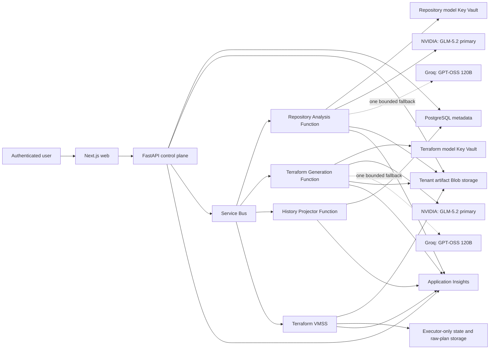
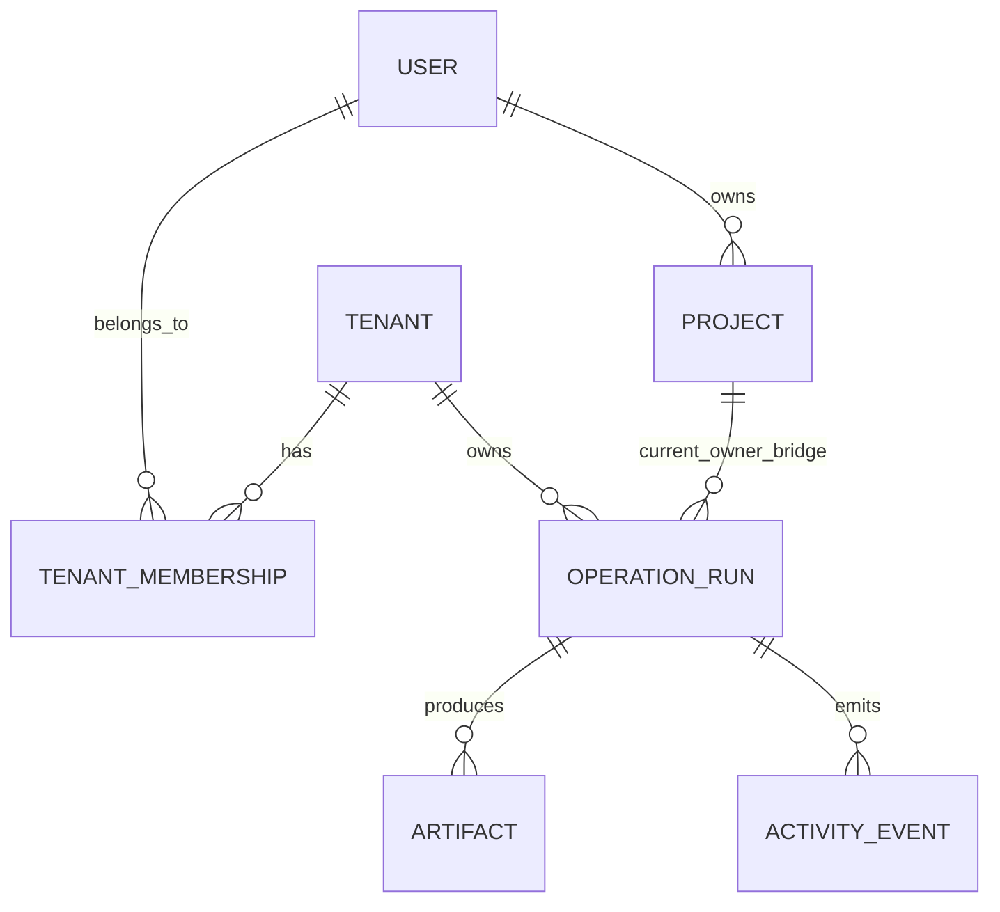
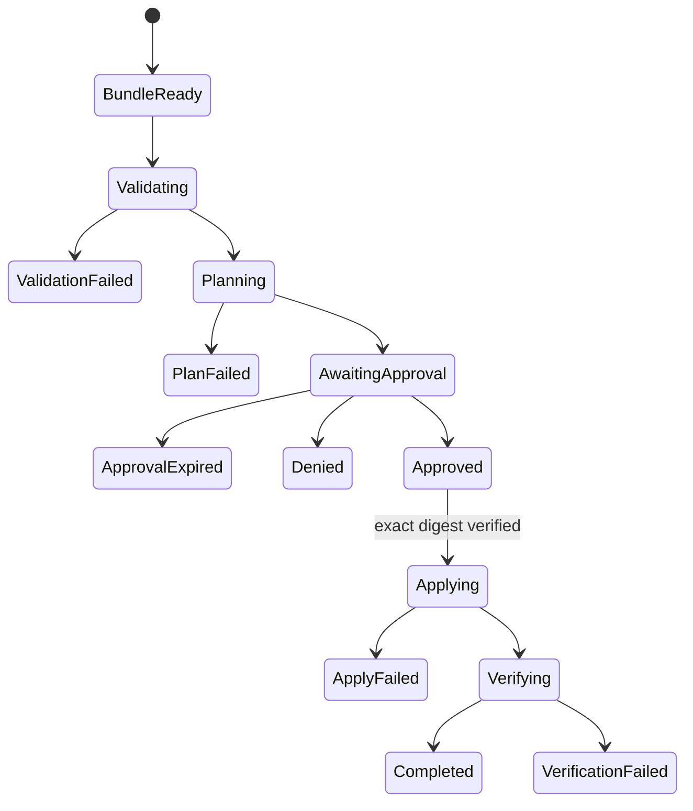

# ZeroOps AI Azure Enterprise Architecture

## Purpose

This document explains the implementation-level architecture for the
tenant-ready ZeroOps control plane. `infra/` is the deployable Terraform source
of truth; `.azure/infrastructure-plan.json` is a conceptual decision graph and
`.azure/deployment-plan.md` records deployment status and validation evidence.

No ZeroOps workload resource has been deployed from this work. An earlier
planning attempt did automatically register subscription resource providers;
the Terraform provider now explicitly disables implicit registration. See the
deployment plan before any Azure action.

The design optimizes for four non-negotiable properties:

1. tenant isolation and complete history;
2. separate trust boundaries for repository analysis and Terraform generation;
3. deterministic validation and human approval before infrastructure changes;
4. low idle cost with explicit production upgrades.

## System context

The API orchestrates; it does not run model inference or Terraform. Each
asynchronous stage gets only the identity and data access required for its
single responsibility.

## Trust boundaries

### Browser boundary

- The browser receives tenant-filtered metadata and authenticated streamed
  artifact downloads after server-side ownership and integrity checks.
- It never receives storage credentials, Service Bus credentials, model keys,
  Terraform state, or raw saved plans.
- Every history and artifact request is authorized again on the server.

### API boundary

- Authentication establishes a user identity.
- Tenant middleware resolves an active internal ZeroOps tenant.
- Authorization verifies membership and resource ownership.
- The API creates immutable run and artifact records before enqueueing work.
- Queue messages carry opaque IDs, digests, and URIs rather than payloads.

### AI boundaries

- Repository-analysis and Terraform-generation settings use different names,
  Key Vaults, managed identities, provider clients, caches, budgets, and audit
  records.
- A failure in one route cannot cause the other route's credential to be used.
- Each workload may make one explicit, strict-schema Groq fallback request only
  after its NVIDIA provider or output contract fails. There is no generic
  `GROQ_API_KEY` lookup or recursive provider registry.
- Input-budget, evidence-policy, and Terraform safety rejection never trigger a
  fallback model call.
- GitHub login OAuth tokens are not model credentials.
- Repository content and approved-plan content are untrusted data, never
  instructions.
- Model output is untrusted until schema and policy validation succeeds.

### Executor boundary

- The VMSS has no model credentials.
- It reads only an immutable bundle identified by an expected SHA-256 digest.
- Plan and apply are separate jobs.
- Apply uses the exact saved `plan.tfplan`; it never regenerates a plan after
  approval.
- Raw plans and state remain in an executor-only account because sensitive
  values can appear in both.

## Tenant model

An internal ZeroOps tenant is independent of a customer's Microsoft Entra
tenant. Existing users receive a personal tenant automatically so the current
single-user experience remains unchanged.

`OperationRun`, `Artifact`, and the new durable `ActivityEvent` records carry
`tenant_id`. Existing `Project` records remain user-owned while the personal
tenant bridge is in place; authorization verifies that project ownership and
tenant membership agree. PostgreSQL
row-level security remains a pre-enterprise-multitenant hardening gate until
the connection pool sets and clears a transaction-scoped tenant context; it is
not claimed as active in the current MVP and will never replace application
authorization.

Blob containers use an opaque derived tenant label, never an email, company
name, GitHub login, or raw UUID. Every immutable user artifact uses
`t-<40 hex>/objects/<artifact UUID>/v<positive>/<SHA-256>`. Metadata in
PostgreSQL stores the opaque container/path, version, and SHA-256 digest.

## Durable history

The history projector is the single asynchronous writer for workflow history.
It consumes versioned, idempotent events such as:

- `repository.snapshot.created`
- `repository.analysis.started|completed|failed`
- `terraform.generation.started|completed|failed`
- `terraform.validation.completed|failed`
- `terraform.plan.completed|failed`
- `approval.requested|approved|denied|expired`
- `terraform.apply.started|completed|failed`
- `postdeploy.verification.completed|failed`

Every event contains:

- event ID and schema version;
- tenant, project, run, and correlation IDs;
- stage and attempt number;
- occurred-at timestamp;
- actor type and actor ID;
- artifact IDs and digests, never artifact bodies;
- provider/model/prompt/schema versions when relevant;
- token, latency, and cost metadata when relevant;
- a redacted error code and safe message on failure.

The projector upserts by event ID. Delivery is at least once, but the history is
effectively once because duplicate event IDs have no second effect.

## Repository analysis

The deterministic scanner is authoritative for facts such as detected files,
dependency versions, ports, frameworks, generated manifests, and command
availability. The model:

- summarizes evidence;
- explains risks and limitations;
- proposes prioritized improvements;
- identifies unresolved questions;
- highlights cost drivers and optimization candidates.

The model cannot declare a scanner check passed, invent a vulnerability, invent
a price, choose an unapproved deployment target, or execute a command.

If neither the NVIDIA repository route nor its workload-local Groq fallback
succeeds, the stage may complete as `deterministic_only`. That state is visible
in provenance and must not be presented as a model-assisted analysis.

## Terraform generation

Terraform generation starts only from an approved architecture revision and
digest. Input includes an allowlisted Azure component catalog, policy bundle,
region, environment, variable names, and verified pricing evidence. It excludes
secret values.

Output must map every file/resource to an approved component. Validation rejects:

- absolute paths or path traversal;
- files outside the allowlist;
- providers other than approved Azure providers;
- `local-exec`, `remote-exec`, `null_resource`, or arbitrary external commands;
- embedded credentials or secret defaults;
- resources absent from the approved architecture;
- public network access that was not explicitly approved;
- model assertions that validation, plan, price, or apply already succeeded.

Terraform generation fails closed when neither its NVIDIA primary nor its
workload-local Groq fallback produces a valid, policy-safe bundle. Generation
can enqueue only a plan job; apply remains a separate approval-gated operation.

## Plan and apply state machine

The worker already re-binds a plan/apply envelope to the bundle digest, saved
plan digest, ETag, state key, and a 24-hour maximum approval age. Durable API
issuance and atomic single-use consumption of a scope/cost approval envelope
are not implemented yet; they are mandatory before any production apply.

## Storage classification

| Class | Examples | Location | User download |
|---|---|---|---|
| Public-safe metadata | run status, timestamps, safe error code | PostgreSQL | Through API |
| Tenant artifact | repository snapshot, structured analysis, Terraform source bundle | Tenant artifact account | Authenticated API streaming |
| Sanitized executor output | plan JSON with sensitive fields removed, cost/evidence summary | Tenant artifact account | Authenticated API streaming |
| Restricted executor data | state, raw saved plan, crash checkpoint | State account | Never |
| Secret | model token, SMTP secret, signing secret | Appropriate Key Vault | Never |
| Telemetry | redacted traces, metrics, dependency status | App Insights / Log Analytics | Operations only |

Blob versioning, soft delete, change feed, and point-in-time restore protect
durable accounts. Lifecycle rules move inactive tenant artifacts to cooler tiers
and expire executor data at the shortest operationally safe retention.

## Networking

- VMSS has no public IP and no inbound administration port.
- Workload subnets have dedicated NSGs.
- NAT provides stable outbound access where public testing endpoints are still
  necessary.
- Production private endpoints are individual resources per service and
  subresource; they are not modeled as a single conceptual endpoint.
- Private DNS zones cover Blob, Queue, Table, File, Service Bus, Key Vault, ACR,
  App Service, and PostgreSQL as applicable.
- Public endpoints are allowed only in the test profile and only with Entra
  authentication, TLS, explicit firewall rules, and no shared keys.

## Reliability

- Service Bus uses dead-letter queues and bounded retries.
- Every job has an idempotency key and immutable input digest.
- Functions use separate host storage so a failure or throttle in one workload
  does not corrupt another workload's runtime state.
- VMSS jobs renew a lease and heartbeat. Lost workers make jobs recoverable,
  not silently successful.
- Apply protects its VM instance from scale-in.
- PostgreSQL and Blob metadata store enough information to resume or explain a
  failed stage.
- Production enables zone redundancy only for services and SKUs that support it
  in Central India.

Target recovery objectives for the single-region production profile:

| Data/workload | RPO | RTO |
|---|---:|---:|
| PostgreSQL metadata/history | ≤ 5 minutes | ≤ 60 minutes |
| Tenant artifacts | ≤ 15 minutes | ≤ 60 minutes |
| Terraform state/raw plan | zero committed-state loss using Blob lease/versioning | ≤ 60 minutes |
| Queue work | at-least-once replay | ≤ 30 minutes after service recovery |

Multi-region disaster recovery is deferred until the product has customer/SLO
evidence that justifies its cost.

## Observability

All components propagate W3C trace context and the safe dimensions
`tenant_id`, `project_id`, `run_id`, `stage`, `attempt`, and `correlation_id`.
Telemetry must not contain source bodies, model credentials, model prompts with
repository content, Terraform state, raw plans, access tokens, or user PII.

Key service-level indicators:

- queue age and dead-letter count by stage;
- job success/failure and retry rate;
- model request/token/latency/cache rate by workload;
- schema and policy rejection rate;
- VMSS cold-start and job duration;
- plan-to-approval and approval-to-apply time;
- monthly estimated versus actual cost by tenant/project;
- history projection lag and duplicate-event count.

## Cost architecture

The test profile intentionally reuses existing B1 and B1ms resources, uses
scale-to-zero Functions, a zero-capacity VMSS, Standard Service Bus, Basic ACR,
LRS host storage, and 30-day sampled telemetry.

Production upgrades are independent opt-ins. A deployment may enable Premium
Service Bus or private ACR only when the corresponding networking/SLO
requirement is enabled. The configuration does not force all premium choices as
one expensive bundle.

Numeric cost is accepted only from a versioned pricing snapshot or a
deterministic cost tool. Models can compare tradeoffs but cannot invent an
amount. The Terraform optional Azure budget and bounded AI I/O are implemented;
per-tenant monetary/token budget enforcement and actual-cost attribution remain
production gates rather than current claims.

## Deferred decisions

The following are intentionally outside the first implementation:

- multi-region active/active or active/passive failover;
- Azure AI Search or a vector database;
- APIM as an AI gateway;
- Front Door Premium/WAF;
- customer-managed encryption keys;
- dedicated storage accounts per tenant;
- Spot instances for any apply workload;
- autonomous approval or autonomous production apply.

Each requires measured scale, compliance, latency, or cost evidence before it is
added.
