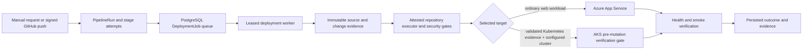

# Pipeline Execution

The ZeroOps pipeline is a durable, evidence-producing state machine. A stage
is included or skipped from deterministic repository and target facts; it is
not considered successful merely because a tool is absent.

## Implementation status

- **Implemented and covered by repository tests:** stage planning, guarded
  transitions, predecessor ordering, configuration versioning, run/stage
  persistence, source/change evidence, repository-command planning and
  isolation-attestation validation, scanner persistence,
  App Service selection, existing-cluster AKS selection and adapter contracts,
  and signed push
  trigger ingestion. Authenticated approval/rejection, HMAC-bound fresh-run
  verification, and the dashboard approval states and controls are also
  implemented; the frontend contract passes type checking.
- **Partially implemented:** no production `RepositoryCheckExecutor` is
  connected. Applicable dependency, quality, test, and build commands therefore
  fail closed before tool resolution; they are not run on the credentialed
  release worker. Other stages still depend on external tools or services in
  the deployed worker. Monitoring registration does not install an Azure
  telemetry collector and is explicitly unclaimed. A project-level toggle to
  make high findings blocking is also not connected.
- **Blocked:** the separate Terraform Service Bus/VMSS saved-plan apply flow is
  not connected to this release pipeline. Terraform apply is fail-closed: the
  VMSS entry point polls only the plan queue, autoscale watches only that queue,
  the workload identity has Reader rather than Contributor, and no application
  sender or executor receiver RBAC exists for the reserved apply queue.
  AKS application mutation is also blocked before server-side apply until a
  hardened external Service/Ingress verifier exists.
- **Not live verified:** neither an App Service nor AKS release was performed
  as part of this change set.

## Execution flow



The active release queue is the PostgreSQL `deployment_jobs` table. A worker
claims a job with a bounded lease, renews it by heartbeat, and uses a lease
token to fence stale workers from crossing or updating the deployment
side-effect boundary. Jobs retry only within the configured queue-attempt
limit; losing a lease stops release processing.

The `infra/`, `functions/`, and `worker/vmss_main.py` Service Bus architecture
is a separate Terraform execution design. Its queue envelopes and isolated
executor are not a replacement name for the active PostgreSQL release queue.
The current `worker/Dockerfile` starts that VMSS entry point; a production image
for `worker.main` and the PostgreSQL application-release path has not been
verified by this change set.

## Trigger behavior

### Manual release

`POST /api/deployments/deploy` authenticates the user, checks project
ownership, resolves the selected branch to an immutable GitHub commit, requires
an approved architecture plan, runs the deterministic preflight, selects a
ready Azure target, creates the deployment/run/stages, and queues a
`DeploymentJob` without copying an OAuth token into the queue.

The worker decrypts the stored GitHub token only for the active source clone.
Uploaded source is not accepted by the isolated queue worker because there is
no durable shared upload-artifact handoff for that path.

### GitHub push

`POST /api/webhooks/github/{project_id}` validates the project-scoped
HMAC-SHA256 signature before processing the event. Delivery ID, repository,
configured branch, immutable commit SHA, project configuration, approved plan,
and Azure readiness must all match. Duplicate deliveries return the existing
result instead of creating another run.

Push behavior also depends on `deployment_mode`:

| Mode | Stage graph | Queue behavior |
|---|---|---|
| `deploy_after_checks` | Checks followed by the selected deployment path | A deployment job is queued only after webhook preflight succeeds. |
| `validate_only` | Deployment, health, smoke, container-build/image-scan, and monitoring stages are skipped with explicit reasons | The connected worker runs all other applicable checks, then marks the run `succeeded` and the legacy deployment `stopped`; it publishes no ACR image and creates no cloud release. If a trigger cannot reach that durable worker, it must report blocked/unavailable instead. |
| `require_approval` | An approval stage is required before cloud mutation | The initial worker runs non-mutating checks and stops with `PipelineRun=blocked` and `Deployment=stopped`. An authenticated project owner can approve into a fresh bound run from the dashboard or reject/cancel the original. This is covered by backend tests and frontend type checking, but not a live Azure end-to-end release. |

## Approval handoff

The current code exposes:

```text
POST /api/pipeline-runs/{run_id}/approve
POST /api/pipeline-runs/{run_id}/reject
```

The deployments dashboard renders the API's factual `pending`,
`approved_consumed`, and `rejected` states. For a pending project-owned run,
the owner can approve and navigate to the newly queued execution, or reject
the release. It does not present a consumed or rejected validation run as
still actionable.

Approval is not a resume of the old process. The API first requires the
project-owned validation run to be blocked at Approval with all predecessor
stages succeeded/skipped. It rejects approval when the latest architecture
plan or versioned pipeline configuration differs from the validated one.

On approval, the API creates a new `Deployment`, `PipelineRun`, and
`DeploymentJob` bound to the same 40-character source SHA, branch, selected
target, plan ID/revision, and configuration ID/version/digest. It signs those
claims plus both old/new run and deployment IDs and the approving actor/time
with domain-separated HMAC-SHA256 evidence. The worker checks the signature,
all immutable bindings, and the prior blocked run/stages before it can pass
Approval. The fresh run repeats checks to reduce time-of-check/time-of-use
risk.

Consumed evidence is bound to the unique new deployment and run IDs and does
not expire merely because a durable queue waits through a worker outage. The
verifier rejects approval timestamps more than five minutes in the future.
The atomic one-use decision and immutable HMAC bindings, rather than a short
age limit, prevent that evidence from authorizing another release.

The API and worker must read the same stable production `JWT_SECRET` from Key
Vault because it is the current signing key for this domain-separated approval
evidence. Separate processes with independently generated development secrets
cannot validate each other's approval.

The original decision is marked consumed so a repeated approve request returns
the already-created run. Rejection cancels the blocked run and remaining
stages without creating a job.

Migration `007_change_analysis_retry_history` also allows each distinct fresh
approval-bound run against the same immutable revision and fingerprint to
retain its own `ChangeAnalysis`. The same-run idempotency constraint remains,
and repeating the same approval request still returns its already-created run.

This handoff is code-implemented and locally verified by approval route/runtime
tests, the backend suite, and the frontend type check. It has not been verified
as a complete API-to-worker flow against a live Azure release, so this is not a
claim of operational production readiness.

## Stage graph

The worker reconciles the initial graph after cloning source, because only then
can it know which dependency manifests, tests, IaC files, and Kubernetes
assets actually exist.

| Stage | Applicability | Primary evidence/tool |
|---|---|---|
| Source | Always | Repository identity, branch, immutable commit, safe workspace |
| Change Detection | Always | Bounded repository snapshot, prior snapshot, Git path diff when available |
| Repository Analysis | No prior snapshot or deployment-relevant architecture change | ZeroOps AI route, with deterministic fallback where supported |
| Dependency Installation | Supported dependency manifest and policy enabled | Lockfile-aware command through an attested disposable executor; currently unavailable because no production executor is connected |
| Code Quality | Application source and policy enabled | Supported lint/type-check command through the same executor boundary; currently unavailable in production |
| Unit Tests | Detected test command and policy enabled | Supported test command through the same executor boundary; currently unavailable in production |
| SAST | Application source and policy enabled | Semgrep |
| Dependency Security | Dependency manifest and policy enabled | Trivy filesystem vulnerability scan |
| Secret Scan | Policy enabled | Gitleaks in redacted, no-Git mode |
| Build | Detected build step | Supported build command through the same executor boundary; currently unavailable in production |
| Container Build | Container target | Azure Container Registry build path |
| Container Security | Image produced and policy enabled | Trivy image scan |
| SBOM | Container-target pipeline and SBOM policy enabled | Syft source-repository CycloneDX metadata; it is not associated with the container digest |
| Kubernetes Validation | AKS target | Manifest policy, kubeconform, Trivy configuration scan, server dry-run |
| Infrastructure Validation | Repository IaC or detected infrastructure change | Explicitly unavailable until `terraform fmt`, isolated `init -backend=false`, `validate`, and TFLint run in a verified disposable executor |
| IaC Security | IaC present/change and policy enabled | Checkov adapter; it cannot substitute for Terraform validation |
| Terraform Plan | Infrastructure change | Isolated saved-plan flow; not connected to active release orchestration |
| Approval | Production/infrastructure policy requires it | Durable actor decision |
| Infrastructure Provisioning | Approved infrastructure change in a deploying mode | Blocked until atomic plan/apply integration is complete |
| Application Deployment | Non-validation mode | App Service; AKS currently becomes unavailable before cluster mutation because external verification is incomplete |
| Health Check | Application deployed | App Service exact-origin direct 2xx, or AKS rollout/pod readiness |
| Smoke Test | Application deployed | App Service exact-origin direct 2xx; AKS cannot reach this stage because application deployment pre-blocks while external verification is unavailable |
| Monitoring Registration | Application deployed | Currently skipped/unclaimed with explicit unavailable telemetry metadata because no collector writer is connected |
| Deployment/Validation Complete | Predecessors complete | Final durable run and deployment state |

The graph may evolve, but stage keys and attempts are normalized records. The
legacy `infrastructure_metadata.stages` view exists for compatibility and UI
streaming; it is not the authoritative lifecycle store.

## Lifecycle rules

Execution states are:

```text
queued, running, succeeded, failed, skipped, blocked, unavailable, cancelled
```

Important semantics:

- A stage cannot start until every earlier applicable stage is `succeeded` or
  explicitly `skipped`.
- `skipped` means the stage is irrelevant or disabled and always carries a
  reason.
- `unavailable` means applicable work could not be performed, such as a
  missing scanner or unreachable required service. It is a blocking outcome.
- `blocked` means a policy or authorization gate prevents progress.
- Failure, blocked, unavailable, skipped, and cancelled transitions require a
  redacted reason.
- A blocked run cannot resume without an explicit authorized resume operation.
- Stage evidence is bounded; raw scanner output, source, credentials, model
  prompts, Terraform state, and binary plans are not stage evidence.

## Repository commands

The deterministic repository checker discovers supported Node and Python
components, their lockfiles, package managers, and declared scripts. It builds
commands from an allowlisted plan and never executes arbitrary AI-generated
commands.

Public execution requires an explicit `RepositoryCheckExecutor`, the immutable
source revision and repository digest, and a fresh attestation for the exact
source. The attestation must prove a disposable boundary with no worker
filesystem, database, Key Vault, or IMDS access. Network is denied except for a
restricted-egress dependency-installation policy. The active worker passes no
executor, so applicable repository commands return `unavailable` before any
tool lookup or subprocess. The private local runner exists only for low-level
tests and is not a production fallback.

A missing executor, invalid/expired attestation, source mismatch, missing
runtime, or missing package manager is unavailable and blocking. A repository
without a supported command may skip that specific stage with a factual reason;
it must not manufacture a successful test or build result.

## Security gates

Security scanners must be installed on a trusted worker `PATH`. Each scanner
runs with a timeout, bounded output, a restricted environment, and a strict
JSON parser. Required scans fail closed for missing tools, malformed output,
unexpected exit status, or an unverifiable tool version. Policy findings can
produce `warning` or `blocked`. The current general pipeline blocks critical
findings and warns on high findings because no project-level high-block policy
exists yet. AKS manifest scanning blocks both critical and high findings.

See [DevSecOps implementation](devsecops.md) for the tool map.

## Target selection

The target-status API currently advertises AKS as not ready because hardened
external verification is a missing prerequisite. Automatic selection therefore
blocks when deterministic Kubernetes evidence indicates AKS; it does not
silently deploy that workload to App Service. Once the blocker is implemented,
AKS selection still requires Kubernetes manifests, one Helm chart, or Kustomize
configuration plus every existing-cluster prerequisite. Repositories without
Kubernetes evidence continue to prefer App Service.

Selection is not a claim that the target can currently complete. The AKS
runtime deliberately stops before server-side apply while its external
Service/Ingress verifier is unavailable, preventing a partially deployed
public workload from being left behind after a known blocking stage.

An explicit AKS request fails while the verification blocker remains (and also
fails if Kubernetes evidence is absent). It never falls back silently to AKS
based only on a model suggestion. An explicit or automatic App Service release
requires its existing Linux plan. See
[Existing-cluster AKS deployment](aks-deployment.md).

For an App Service deploying mode, the worker builds in ACR, resolves the
pushed tag to an immutable `sha256` digest, and scans that digest before
deployment. ACR returning only a mutable tag is an unavailable, blocking
outcome. AKS is rejected at target readiness before this path while its verifier
is missing. Validation-only mode intentionally performs no ACR build or image
scan.

App Service can receive configured application settings through its protected
settings-file path. AKS currently has no safe ZeroOps environment-variable to
Key Vault/CSI binding. An AKS release with any configured project environment
variables fails closed rather than dropping them.

## Failure diagnosis

Pipeline exceptions and command diagnostics are redacted before persistence or
streaming. Where AI failure diagnosis is enabled and a durable pipeline
failure path is available, the investigation receives a structured, bounded
evidence set and persists provider/model/prompt provenance plus a structured
answer. A model diagnosis cannot change the deployment state or authorize a
remediation.

The investigation is first committed as `running`, then receives bounded,
redacted stage diagnostics plus revision/change evidence. If a validated model
result returns, the record becomes `succeeded` with actual provider/model
provenance. If the route is unavailable or violates its output contract, the
useful deterministic fallback is persisted as `unavailable` with
`AI_PROVIDER_UNAVAILABLE`; it is never presented as successful AI work.
Deterministic pipeline failure state remains authoritative either way.

## Operational prerequisites

- PostgreSQL migrations through `007_change_analysis_retry_history`
- A running leased deployment worker with database access
- Azure CLI and target-specific credentials supplied through Key Vault
- GitHub access for queued GitHub source
- Required scanner tools in the release worker
- A deployed `RepositoryCheckExecutor` satisfying the source-bound disposable
  isolation contract, with required runtimes/package managers inside it
- For AKS, the additional constraints in `docs/aks-deployment.md`

The current development host had kubectl but not the other scanner/AKS tools.
The separate `worker/Dockerfile.pipeline` pins the complete application-release
toolchain and platform CI builds and inspects it, but the local Docker daemon
was unavailable and the image was not published or deployed. Scanner and AKS
integration tests therefore use controlled tool responses and do not constitute
a real-tool or live-cluster execution pass.

Do not enable production automatic deployment until these are verified in the
actual worker image and a non-production Azure workload has completed the same
pipeline end to end.
